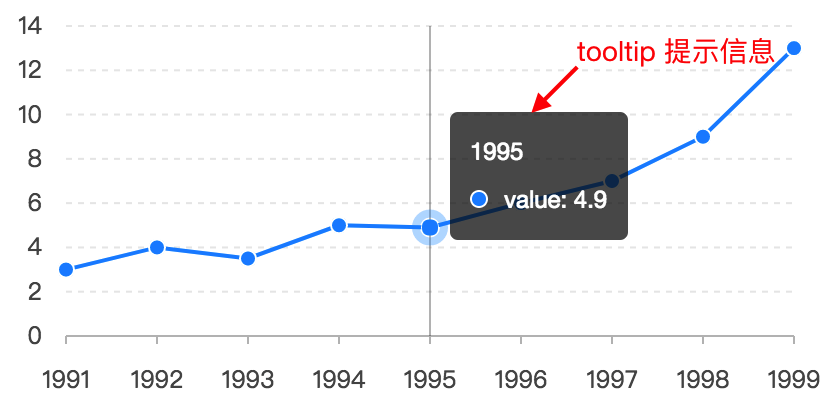
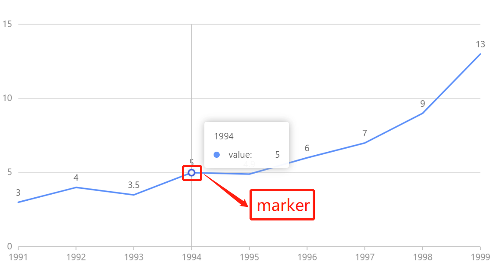
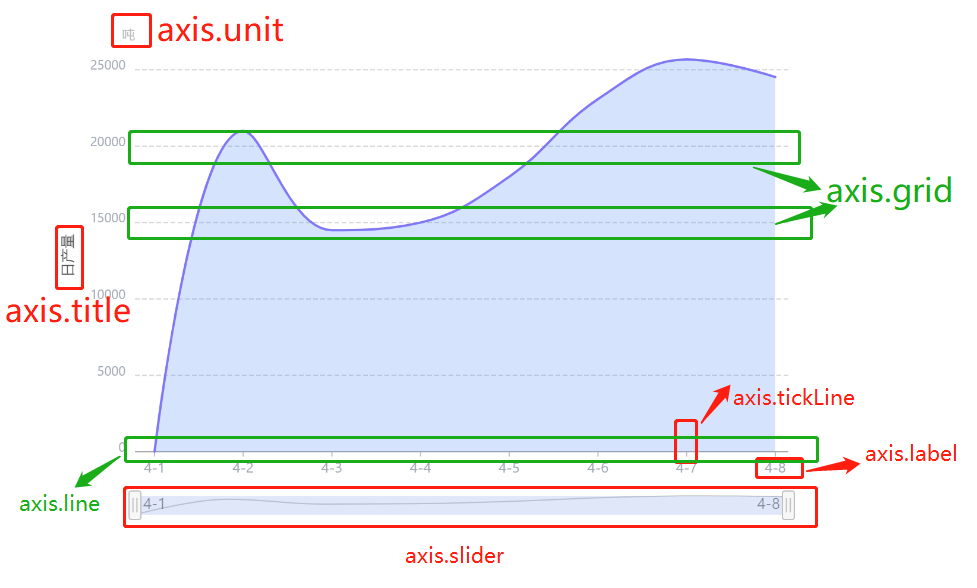

# 折线图参数 

### chartBasic

`chartBasic`表示图表对象的一些基础配置，比如图表宽（`width`）高（`height`）、内边距(`padding`)等。

##### chartBasic.width
- `type`: `Number ` 
- `default`: `undefined`  

图表的宽度。

##### chartBasic.heigth
- `type`: `Number ` 
- `default`: `'undefined'`  

图表的高度。

> `width`和`height`可以省略，图表的宽高默认自适应父元素的宽高。

##### chartBasic.padding
- `type`: `'auto' | Number | Number[]` 
- `default`: `'auto'` 


### data
- `type`: `Array`
- `default`: `[]`

图表的数据。

目前只支持一种数据结构：

```javascript
const data = [
  { genre: 'Sports', sold: 275, age: 10, team: 'team1' },
  { genre: 'Strategy', sold: 115, age: 20, team: 'team1' },
  { genre: 'Action', sold: 120, age: 20, team: 'team2' },
  { genre: 'Shooter', sold: 350, age: 10, team: 'team2' },
  { genre: 'Other', sold: 150, , age: 10, team: 'team3' },
];
```

### xField
- `type`: `String`  
- `default`: `'x'`

`x`轴字段。

以那个字段作为`x`轴的数据(默认以`data`数据中的`x`字段)：
```javascript
xField = 'genre'
```

### yField
- `type`: `String` 
- `required`: `True`  

`y`轴字段。

以那个字段作为`y`轴的数据(默认以`data`数据中的`y`字段)：
```javascript
yField = 'sold'
```

### seriesField
- `type`: `String` 
- `default`: `'undefined'`
- `required`: `False`   

多条图形的分组字段。

当有多条图形：多条折线图，多条面积图，通过那个数据字段对数据进行分组：
```javascript
const data = [
    { genre: 'Sports', sold: 275, age: 10, team: 'team1' },
    { genre: 'Strategy', sold: 115, age: 20, team: 'team1' },
    { genre: 'Sports', sold: 120, age: 20, team: 'team2' },
    { genre: 'Strategy', sold: 350, age: 10, team: 'team2' },
    { genre: 'Sports', sold: 150, , age: 10, team: 'team3' },
    { genre: 'Strategy', sold: 150, , age: 10, team: 'team3' },
];
seriesField = 'team'
```
以上的`data`和`seriesField`配置最终会将数据分为三组，展示三条线段：

```javascript
const data1 = [
    { genre: 'Sports', sold: 275, age: 10, team: 'team1' },
    { genre: 'Strategy', sold: 115, age: 20, team: 'team1' },
];

const data2 = [
    { genre: 'Sports', sold: 120, age: 20, team: 'team2' },
    { genre: 'Strategy', sold: 350, age: 10, team: 'team2' },
]

const data3 = {
    { genre: 'Sports', sold: 150, , age: 10, team: 'team3' },
    { genre: 'Strategy', sold: 150, , age: 10, team: 'team3' },
}
```

### tooltip
- `type`: `Boolean | Object`
- `default`: `true`  

提示信息，其中包括提示的标题、内容、样式、辅助线等



`tooltip`默认是打开的，内容样式为`g2`图表默认的内容和样式。

关闭`tooltip`的显示，将该项置为`false`即可：
```javascript
tooltip: false
```
#### tooltip.crosshairs
- `type`: `Boolean | Object`,
- `default`: `true`  

`tooltip`的辅助线默认是打开的，样式为`g2`图表提供的样式。如果需要关闭辅助线，设置`crosshairs`为`false`:
```javascript
tooltip = {
    crosshairs: false
}
```
如果需要配置辅助线的样式，传入相关的配置即可。

```javascript
tooltip = {
    crosshairs: {
        // x: x轴上的辅助线 y:y轴的辅助线 default: x(垂直辅助线)
        type: 'x | y | xy', 
        line: {
            // 线条颜色
            stroke: 'l(90) 0:rgba(54, 110, 174,0.1)  1:rgba(129, 170, 212,0.8) ', 
        }
    }
}
```
更多内容可以查看[g2官网-tooltips之辅助线](https://g2-v4.antv.vision/zh/docs/api/general/tooltip#tooltipcfgcrosshairs)。

#### tooltip.marker

辅助线和图形交汇处的标记点。



配置`marker`的样式：

```javascript
tooltip = {
    marker: {
        fill: '#fff',  // 填充色
        stroke: '#397DF9' // 描边色
    }
}
```
::: tip 
有关**轴线样式**的更多内容可以查看：[g2官网-绘图属性ShapeAttrs](https://g2-v4.antv.vision/zh/docs/api/shape/shape-attrs)。
:::

### axis
坐标轴的相关配置：坐标轴标题、坐标轴轴线、坐标轴刻度线、坐标轴刻度值、网格线、缩略轴、最标轴的文本标记。



坐标轴默认显示，可以通过设置`false`将坐标轴关闭。

统一关闭`x`、`y`轴：
```javascript
axis: false 
```

可通过配置单独关闭`x`或者`y`：

```javascript
axis: {
    xAxis: false,
    yAxis: false
}
```
#### axis.title
- `type`: `Boolean | Object`

坐标轴标题。  
 
坐标轴标题默认显示，可通过设置`false`关闭坐标轴标题：

```javascript
// 关闭x坐标轴显示
axis = {
  	xAxis: {
      	title: false
    }
}
```

自定义坐标轴标题内容或者样式：

```javascript
// 配置x坐标轴标题
axis = {
  	xAxis: {
      	title: {
            // 标题文本
          	text: '我是坐标轴的标题文本内容',
            // 标题的位置
          	position: 'left',  
            // ...... 
        }
    }
}
```
::: tip
有关坐标轴标题的更多配置可以查看：[g2官网-axis之坐标轴标题](https://g2-v4.antv.vision/zh/docs/api/general/axis#axisoptiontitle)。
:::

#### axis.line

坐标轴轴线。

坐标轴轴线默认显示，可通过设置`false`关闭坐标轴轴线的显示。

```javascript
axis = {
  	xAxis: {
      line: false,  // 关闭坐标轴线
    }
}
```


详细配置坐标轴的轴线样式：

```javascript
axis = {
  	xAxis: {
        line: {
            // 线宽
			lineWidth: 20,			
        },  
    }
}
```

::: tip 
有关**轴线样式**的更多内容可以查看：[g2官网-绘图属性ShapeAttrs](https://g2-v4.antv.vision/zh/docs/api/shape/shape-attrs)。
:::

#### axis.tickLine
- `type`: `Boolean | Object`

坐标轴刻度线。

坐标轴刻度线默认显示，可通过设置`false`关闭坐标轴刻度线：
```javascript
// 关闭x轴坐标轴刻度线
axis = {
  	xAxis: {
      tickLine: false,
    }
}
```

配置坐标轴刻度线的样式：

```javascript
axis =  {
  	xAxis: {
        tickLine: {
            length： 10, // 刻度线长度
            // ...
        }, 
    }
}

```

更多有关坐标轴刻度线的配置可查看：(g2官网-axis之刻度线)[https://g2-v4.antv.vision/zh/docs/api/general/axis#axisoptiontickline]

#### axis.label

坐标轴刻度值。

坐标轴刻度值默认显示，可通过设置`false`关闭坐标轴刻度值的文本显示：

```javascript
// 关闭x轴坐标轴刻度线
axis = {
  	xAxis: {
        label: false,
    }
}
```

配置坐标轴刻度值：

```javascript
axis =  {
  	xAxis: {
        label: {
            // 刻度值文本旋转角度
          	rotate: 30, 
            // 刻度值文本格式化  
            formatter: (text: string, item: ListItem, index: number) => any
            // ...
        }
    }
}

```

更多有关坐标轴刻度线的配置可查看：(g2官网-axis之刻度值)[https://g2-v4.antv.vision/zh/docs/api/general/axis#axisoptionlabel]

#### axis.grid

坐标轴网格线。

坐标轴网格线默认显示，可通过设置`false`关闭坐标轴刻度值的文本显示：

```javascript
// 关闭x轴坐标轴刻度线
axis = {
  	grid: false
}
```

配置网格线：

```javascript
axis =  {
  	grid: {
        line: {
			type: 'line',  	//网格线类型  
            style: {
                stroke: '#666',   // 线条颜色
                opacity: 0.1,   //透明度
            }
            // ...
                        
        },
        // ...
    }
}

```

更多有关坐标轴网格线的配置可查看：(g2官网-axis之网格线)[https://g2-v4.antv.vision/zh/docs/api/general/axis#axisoptiongrid]

#### axis.slider
- `type`: `Boolean | Object`

坐标轴的缩略轴。

坐标轴缩略轴默认不显示，可通过设置`true`或者`{}`开启缩略轴：

```javascript
// 开启缩略轴
axis = {
  	slider: true | {},
}
```

配置缩略轴：

```javascript
axis =  {
  	slider: {
        height: 20, //组件高度
    }
}

```


##### axis.slider.massData

- `type`: `Boolean`

当图表数据量过大时,开启大量数据缩略轴.(目前大量数据缩略轴不支持样式设置)

`@move-block`自定义事件返回缩略轴的位置
* `type`:`number[]`

``` Vue
<template>
    <Line :data="data" :axis="axis" @move-block="moveBlock"></Line>
</template>
<script>
const axis = {
    xAxis:{
        slider:{
            // 开启大量数据缩略轴
            massData:true
        }
    }
}

function moveBlock(position){
    // 获取到滑块的位置
    console.log(position) // [0,1]
}

</script>
 ```

更多有关坐标轴网格线的配置可查看：(g2官网-缩略轴)[https://g2-v4.antv.vision/zh/docs/api/general/slider]


### legend
图例的相关配置。

图例默认是显示的，可通过传入`false`关闭图例：
```javascript
legend: false

```

### line
- `type`: `Object`

线条相关的内容：线条是否平滑、线条上的点

#### line.smooth
- `type`: `Boolean`

线条是否平滑，默认不平滑，可通过传入`false`设置线段为平滑曲线。

```javascript
line: {
    smooth: true, // 平滑
}
```

#### line.point
- `type`: `Boolean`

线条上是否显示对应的点，默认不显示，可通过传入`true`设置线段的点。

```javascript
line: {
    point: true, // 平滑
}
```

### color

---

### annotation
图形标注，`Annotation`，作为图表的辅助元素，主要用于在图表上标识额外的标记注解。

#### &emsp;annotation.text
辅助文本，指定位置添加文本说明。
* `type`: `TextOption[] | TextOption`

::: tip 
有关**辅助文本**的更多内容可以查看：[g2官网-标注Annotation](https://g2-v4.antv.vision/zh/docs/api/general/annotation#chartannotationimageoption)。
:::

#### &emsp;annotation.image
辅助图片，在图表上添加辅助图片。
* `type`: `ImageOption[] | ImageOption`

``` javascript
//单个标注
const annotation = {
    image:{
            src: arrow,
            start: ['00:00', 'min'],
            end: ['00:00', 'min'],
            offsetX: -7,
        }
}
// 多个标注
const annotation = {
    image:[
        {
            src: arrow,
            start: ['00:00', 'min'],
            end: ['00:00', 'min'],
            offsetX: -7,
        },            {
            src: arrow,
            start: ['00:00', 'min'],
            end: ['00:00', 'min'],
            offsetX: -7,
        },
    ],
}
```

::: tip 
有关**辅助图片**的更多内容可以查看：[g2官网-标注Annotation](https://g2-v4.antv.vision/zh/docs/api/general/annotation#chartannotationshapeoption)。
:::

#### &emsp;annotation.line
辅助线（可带文本），例如表示平均值或者预期分布的直线。
* `type`: `LineOption[] | LineOption`

::: tip 
有关**辅助线**的更多内容可以查看：[g2官网-标注Annotation](https://g2-v4.antv.vision/zh/docs/api/general/annotation#chartannotationlineoption)。
:::

#### &emsp;annotation.regionFilter
区域着色，将图表中位于矩形选区中的图形元素提取出来，重新着色。
* `type`: `RegionFilterOption | RegionFilterOption[]`

::: tip 
有关**区域着色**的更多内容可以查看：[g2官网-标注Annotation](https://g2-v4.antv.vision/zh/docs/api/general/annotation#chartannotationregionfilteroption)。
:::

#### &emsp;annotation.region
辅助框，框选一段图区，设置背景、边框等。option 配置如下：
* `type`: `RegionOption[] | RegionOption`

::: tip 
有关**辅助框**的更多内容可以查看：[g2官网-标注Annotation](https://g2-v4.antv.vision/zh/docs/api/general/annotation#chartannotationregionoption)。
:::

#### &emsp;annotation.dataMarker
特殊数据点标注，多用于折线图和面积图。
* `type`: `DataMarkerOption[] | DataMarkerOption`

::: tip 
有关**特殊数据点标注**的更多内容可以查看：[g2官网-标注Annotation](https://g2-v4.antv.vision/zh/docs/api/general/annotation#chartannotationdatamarkeroption)。
:::

#### &emsp;annotation.dataRegion
特殊数据区间标注，多用于折线图和面积图。
* `type`: `DataRegionOption[] | DataRegionOption`

::: tip 
有关**特殊数据区间标注**的更多内容可以查看：[g2官网-标注Annotation](https://g2-v4.antv.vision/zh/docs/api/general/annotation#chartannotationdataregionoption)。
:::

#### &emsp;annotation.shape
自定义任意类型的图形标记，通过 option 中的 render 回调函数来在图表区域绘制自定义标记。
* `type`: `ShapeAnnotationOption[] | ShapeAnnotationOption`

::: tip 
有关**自定义任意类型的图形标记**的更多内容可以查看：[g2官网-标注Annotation](https://g2-v4.antv.vision/zh/docs/api/general/annotation#chartannotationshapeoption)。
:::
